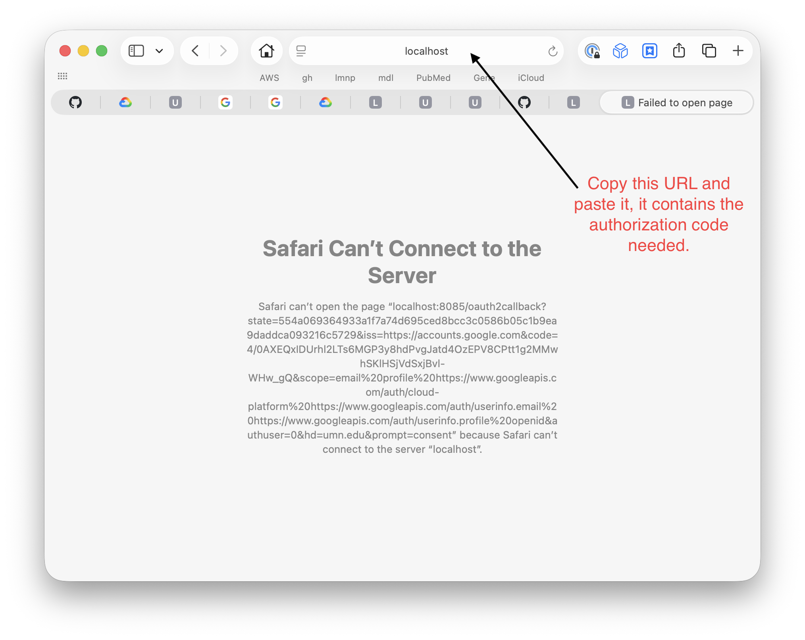

# *Up and Running* with OpenCode and UMN Gemini Models

## Introduction

The UMN has provided access to the Google Gemini AI models. These can be accessed via a chatbot on the [Google web page](https://gemini.google.com), a dedicated [Mac app](https://gemini.google/mac), or via the [GeminiCLI](https://geminicli.com) application. The GeminiCLI has a terminal user interface (TUI) and runs on the command line. However, [OpenCode](https://opencode.ai) is a different TUI that is completely open source, can use any model from any provider (including local models) and is under very active development. OpenCode's TUI is generally considered to have a better user experience. 

To run OpenCode with the UMN Gemini models, we need to:

- Create a Google Cloud Project
- Configure the Google Cloud Project
- Install OpenCode
- Configure OpenCode
- Authenticate with Google via OpenCode


## Create a Google Cloud Project

- Visit Google Cloud: [https://console.cloud.google.com/welcome](https://console.cloud.google.com/welcome)
- Choose your UMN Google Account
- Sign in with UMN SSO & Duo
- Create a new Google Cloud Project:
	- Click on the *projects-name* box near the top of the page, and then click "New Project" (or, just click: [https://console.cloud.google.com/projectcreate](https://console.cloud.google.com/projectcreate))
	- Enter a project name (do not use spaces, use hyphens for delimiter). For example: `USERNAME-gemini`
	- Enter organization name: `umn.edu` (the default)
	- Enter parent resource: `umn.edu` (the default)
	- Click: Create

## Configure the Google Cloud Project

- From the Google Cloud web console, click the "hamburger menu button", click on "APIs & Services", and then click on "Enabled APIs & Services" (or just click: [https://console.cloud.google.com/apis/dashboard](https://console.cloud.google.com/apis/dashboard))
- Click the blue button at the top of the page that says "+ Enable APIs & Services"
- In the search bar in the middle of the page, search for "Gemini for Google Cloud"
- Select the "Gemini for Google Cloud" box, which will open a new page.
- Click the blue "Enable" button. If it says "Manage," it's already enabled.


## Install OpenCode

- Open a terminal, ssh to MSI's agate (login or compute node)
- You can load my version of opencode
- After loading my version, the standard `opencode` executable, and a `oc` wrapper executable will be available in your PATH
    - the `oc` wrapper is preferred because it handles the NFS (VAST) filesystem better without crashing, and if your OpenCode session crashes or your slurm job ends, it saves the session info to your personal ~/.local/opencode/session_backups/ dir 

```
module load /projects/standard/lmnp/knut0297/software/modulesfiles/opencode/1.18.4
```

Run the tool (it might take a few seconds to load the first time):

```
oc
# you can exit the program by typing :q<return> or ctrl-c
```
 

- Alternatively, you can install it yourself. [This is how I installed it](https://github.com/umn-msi-lmnp/knut0297_modules_install_notes/blob/main/opencode_1.15.13_install_notes.slurm).


## Configure OpenCode


- Create or edit the opencode config file: `~/.config/opencoode/opencode.json`
- For example, the following `opencode.json` file includes the opencode-gemini plugin, and provides your Google Cloud Project ID defined above (e.g. `USERNAME-gemini-cli`):

```json
{
  "$schema": "https://opencode.ai/config.json",
  "autoupdate": false,
  "permission": {
    "read": "allow",
    "glob": "allow",
    "grep": "allow",
    "list": "allow",
    "external_directory": "allow"
  },
  "plugin": [
      "opencode-gemini-auth@1.4.10"
  ],
  "provider": {
    "google": {
      "options": {
        "projectId": "USERNAME-gemini-cli"
      }
    }
  }
}
```


## Authenticate with Google via OpenCode

From the command line, connect to Google via:

```
opencode auth login
```

- Select provider: Google
- Login method: Auth with Google (Gemini CLI)
- Click the long link (it should open in your default browser on your MacBook)
	- Login with your UMN account
	- Accept the terms
	- Then it will appear to have failed, returning a "Can't connect to local server" message. That's OK -- it worked!
	- Copy the URL of the "failed" webpage, it should start with "localhost..."
	- Paste the URL back into your HPC terminal, where is says: "Paste the authorization code here:"

 


## Run a Gemini model

- Run `oc` and type `/models` to bring up the models list
- Search "Gemini" to see the available models, and choose `Gemini 2.5 Pro`
- Test a prompt: `hello world`
- If you get an error, let me know (Todd Knutson, knut0297@umn.edu) and we'll get is resolved!
